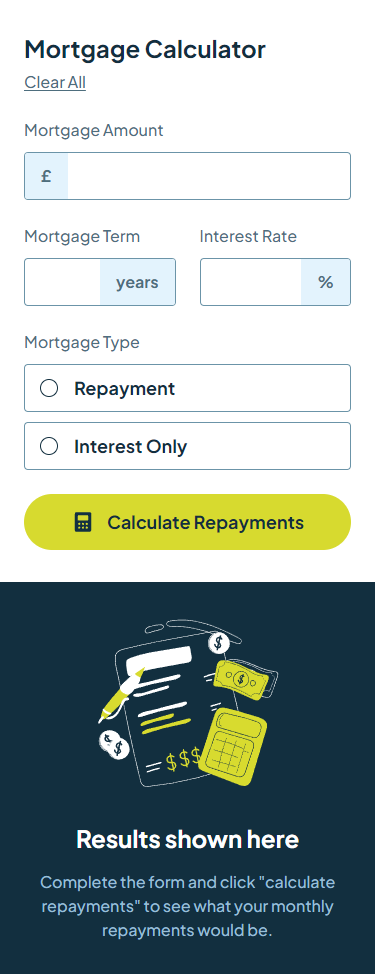
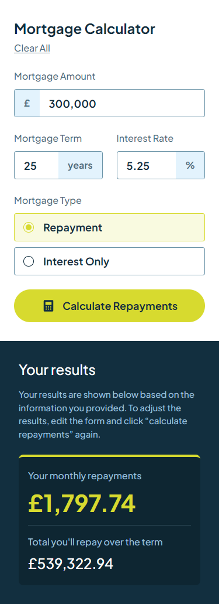
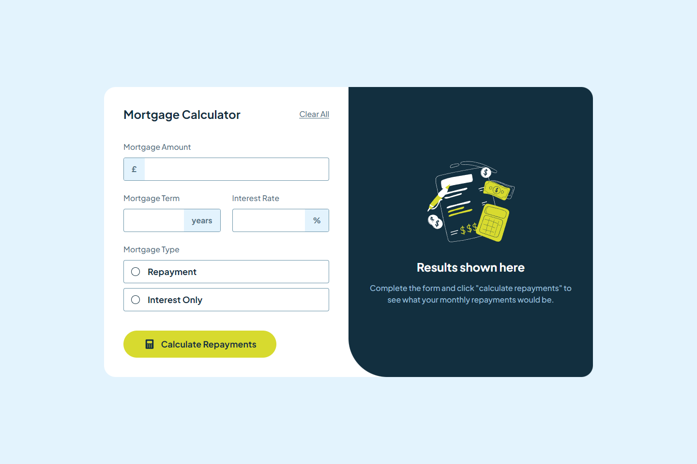
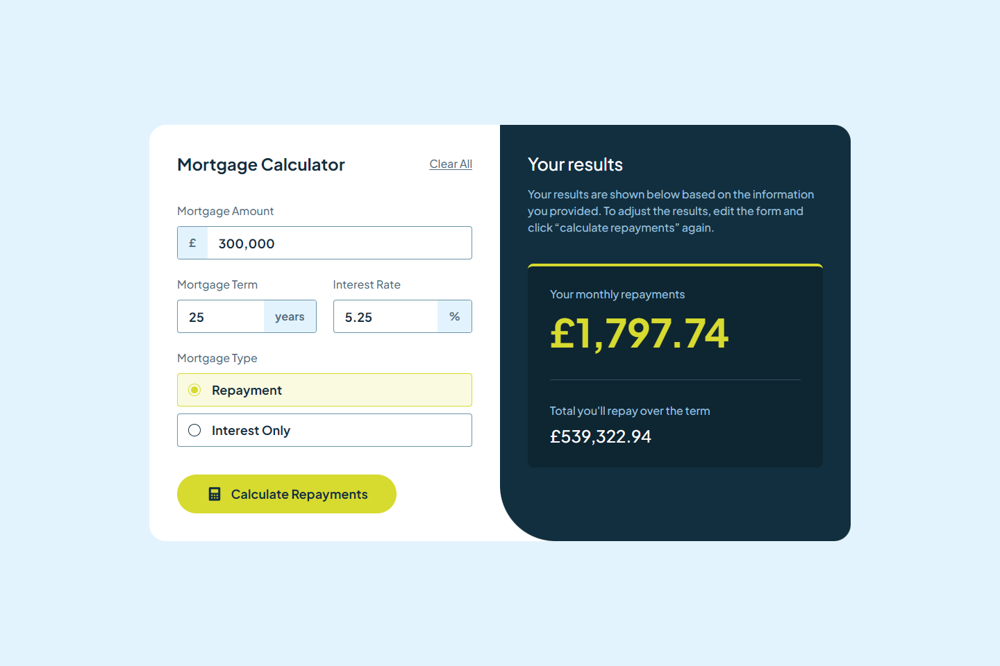
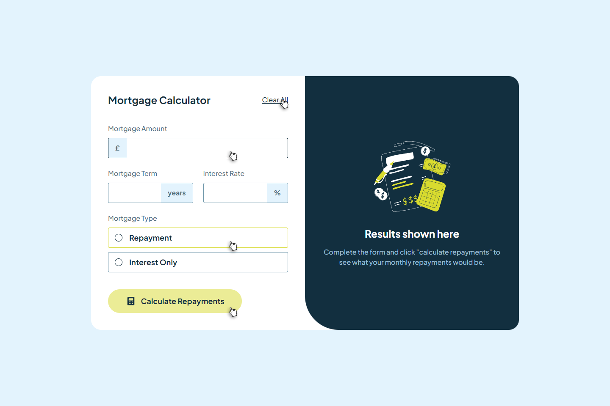
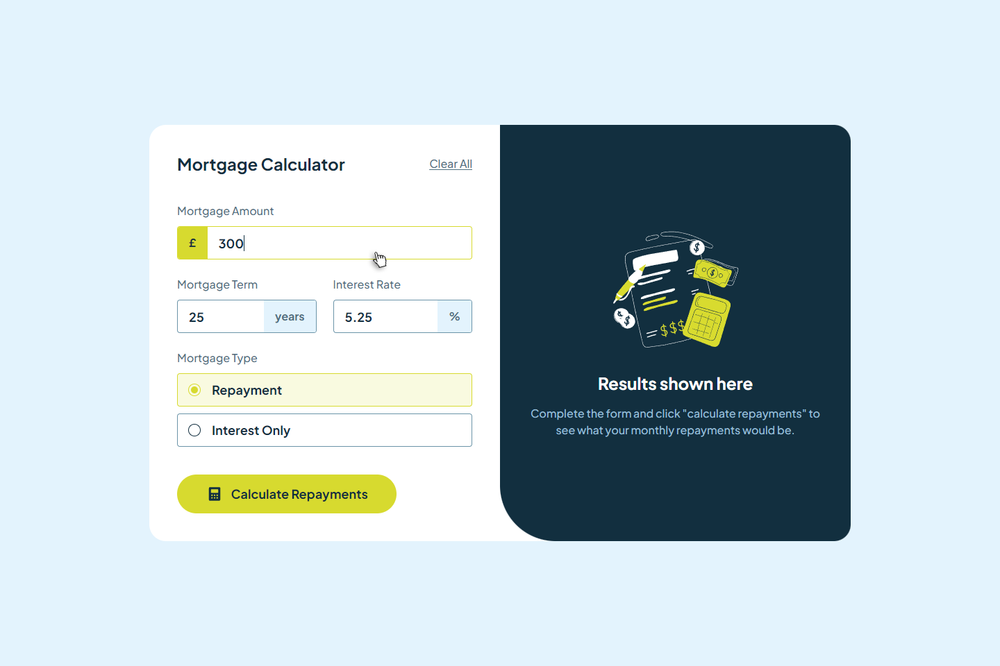
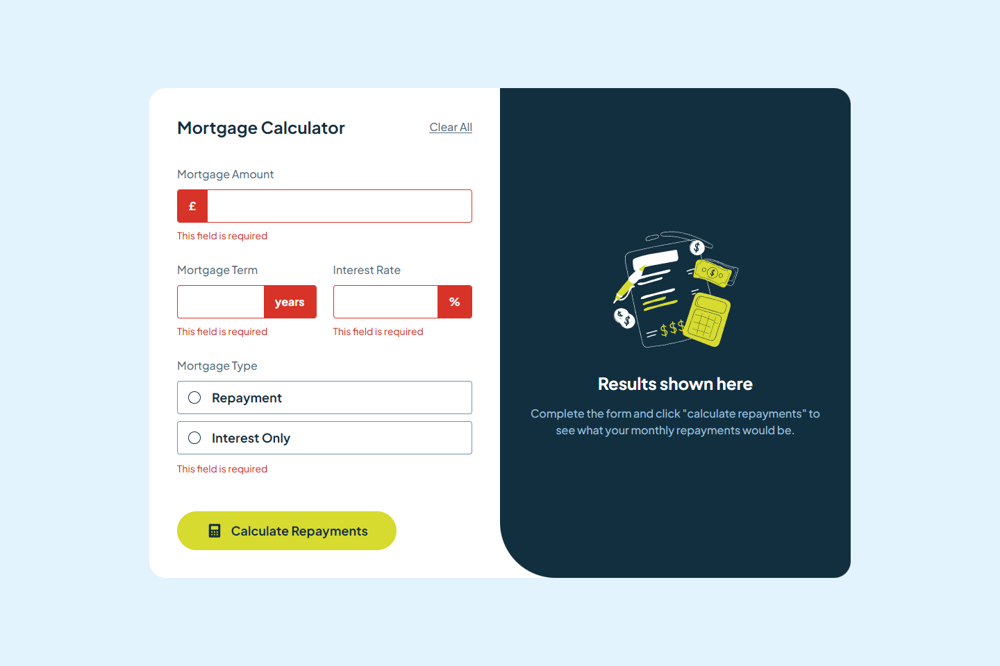

# Frontend Mentor - Mortgage repayment calculator solution

This is a solution to the [Mortgage repayment calculator challenge on Frontend Mentor](https://www.frontendmentor.io/challenges/mortgage-repayment-calculator-Galx1LXK73).

## Table of contents

- [Overview](#overview)
  - [The challenge](#the-challenge)
  - [Screenshots](#screenshots)
  - [Links](#links)
- [My process](#my-process)
  - [Built with](#built-with)
- [Author](#author)

## Overview

### The challenge

Users should be able to:

- Input mortgage information and see monthly repayment and total repayment amounts after submitting the form
- See form validation messages if any field is incomplete
- Complete the form only using their keyboard
- View the optimal layout for the interface depending on their device's screen size
- See hover and focus states for all interactive elements on the page

### Screenshots

### Links

- Solution URL: [https://github.com/nkshey/mortgage-repayment-calculator](https://github.com/nkshey/mortgage-repayment-calculator)
- Live Site URL: [https://nkshey.github.io/mortgage-repayment-calculator/](https://nkshey.github.io/mortgage-repayment-calculator/)

## My process

### Built with

- Semantic HTML5 markup
- CSS Custom Properties
- Flexbox
- CSS Grid
- Mobile-first workflow
- [React](https://reactjs.org/) - React
- [Vite](https://vitejs.dev/) - Vite
- [Tailwind CSS](https://tailwindcss.com/) - For styles
- [Zustand](https://zustand-demo.pmnd.rs/) - For state management

## Author

- LinkedIn - [Nikoloz Peikrishvili](https://www.linkedin.com/in/nikapeikrishvili/)
- Frontend Mentor - [@nkshey](https://www.frontendmentor.io/profile/nkshey)
